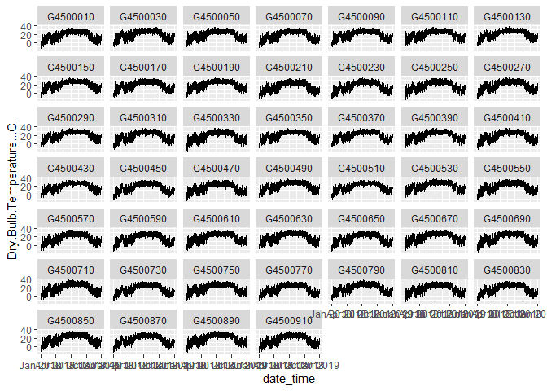
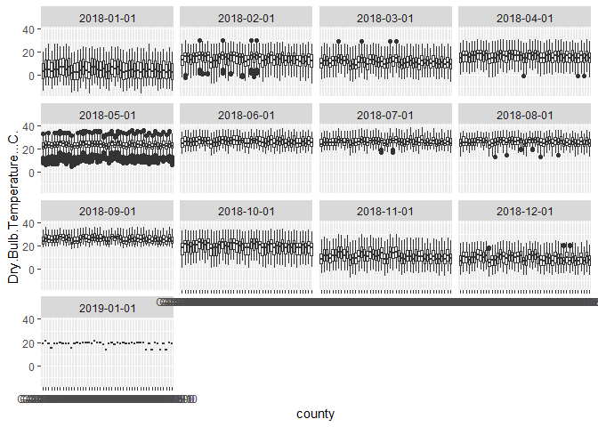

Project
================
Francisco Del Castillo Munoz
2023-10-28

# Introduction

## Project Background

In this simulated case project, we worked with eSC. eSC provides
electricity (power) to residential properties in South Carolina (and a
small part North Carolina). eSC is concerned about global warming,
specifically the impact of global warming on the demand for their
electricity. In short, they are worried that next summer will put too
much demand on their electrical grid (ex. their ability to supply
electricity to their customers when they want to cool their homes). If
this happens there will be blackouts, which eSC wants to avoid. Rather
than build out the capability to deliver more energy to their clients
(i.e., build another power plant), they want to understand the key
drivers of energy usage, and how they could encourage their customers to
save energy. In short, their goal is to reduce energy usage if next
summer is ‘extra hot’, so that they can meet demand (and not build a new
energy production facility).

## Problem Statement

eSC faces a critical challenge as the potential impact of global warming
threatens to increase electricity demand during hot summer months. The
company is concerned that the rising temperatures will lead to excessive
demand for cooling, potentially overwhelming their electrical grid and
causing blackouts. To avoid this, eSC must identify the key drivers of
energy consumption and develop strategies to encourage customers to
reduce their electricity usage during periods of extreme heat. This
approach aims to meet the anticipated demand without the need to build
additional energy production facilities.

## Goals

This project has the final goal to reduce energy usage for next summer.
It is expected that it will be 5 degrees hotter. To achieve this
project’s goal, we have created 3 project objectives: 1. Identify key
drivers and patterns influencing energy demand. 2. Develop predictive
models capable of forecasting energy usage for a given hour and
temperature. 3. Create a tool that predicts daily, and hourly energy
consumption based on key factors such as mean temperature, square
footage of the house, and with next year temperature (5 degrees higher).
4. Determine actionable insight into how to reduce the eSC grid’s stress
due to the energy demand across its consumer base.

## Workflow Used

We follow a modified CRISP-DM framework for this project. This process
has the following steps: 1. Data understanding In this step, we got
familiar with the data, including but not limited to describing the
data, its structure, data types, and relevance. 2. Data Cleaning In this
step, we cleaned the data. We evaluated and treated NA or missing
values, outliers, and inaccurate data. 3. Data Preparation In this step,
we merged all data sets, deleted undesirable columns and features, and
created and derived new data. 4. Exploratory Data Analysis In this step,
we explored the data to extract fundamental insights about it. We used
graphs to identify patterns and relationships between variables and
attributes.  
Furthermore, in this step, we identified data-driven approaches to
reduce peak energy demand. 5. Data Modeling In this step, we developed a
predictive model to forecast the energy usage of July. We tested various
models and selected the best-performing one. 6. Model Evaluation In this
step, we evaluated the model and its accuracy in predicting the energy
usage on new data. 7. Shiny App development In this step, we created a
Shiny app for eSC to interact with our machine learning model, including
visualizing the predicted demand considering relevant attributes and its
insights.

# Data Provided

For this project, I have been provided with the following files by my
professor. 1. Static House Data This file contains the list of all
houses in the dataset. For each house, there is information describing
the house. This information ranges from the building id (used to access
the energy data mentioned below) to other house attributes that do not
change (such as the size of the house). There are around 5,000 houses in
the file. 2. Energy Usage Data The dataset consists of calibrated and
validated energy usage, with 1 hour load profiles. In other words,
within one file, the data describes the usage of energy from many
different sources (ex. air conditioning system, dryer), per hour for
that house. Each file contains individual time-series data of a specific
house, with the ‘building ID’ as file name which identifies the house.
There are approximately 5,000 houses (i.e., different building id’s) in
the directory. 3. Meta Data: A data description file, explaining the
fields used across the different housing data files. There are
approximately 270 attributes. 4. Weather Data: Hour-by-hour weather
information (one csv file for each geographic area) for 1 year. The
timeseries weather data was collected for each of the 50 county and
stored based on a county code. The county code for each house can be
found at ‘in.county’ column of the house static dataset.

# Data Importing, Cleansing and Transformation

## Data Importing

The Weather Data as well as the Energy Usage Data were distributed in
multiple parquet files (5000+ files for the energy data and 50+ files
for weather data) located in AWS which I had to import and merge. I
imported the parquets files with the following code:

### Energy Usage Data

### Weather Data

Download and Export Weather Data

## Data Cleansing and Transformation

### Weather Data

The steps taken to clean the data were the following:

1)  Deleted columns that we are not going to use on the analysis (only
    kept county, temperature, and date)
2)  Change date_time column data type into a date-time data type,
    originally was character.
3)  Create columns for month, day, and hour.
4)  Verify NA and completed values: NA was not found, and everything is
    complete.
5)  Check for outliers:

<!-- -->

1.  Created a line chart and box plot chart for each county to inspect
    the data individually. This was not useful so we will assume that
    the data is correct.

``` r
library (tidyverse)
```

    ## ── Attaching core tidyverse packages ──────────────────────── tidyverse 2.0.0 ──
    ## ✔ dplyr     1.1.4     ✔ readr     2.1.4
    ## ✔ forcats   1.0.0     ✔ stringr   1.5.1
    ## ✔ ggplot2   3.4.4     ✔ tibble    3.2.1
    ## ✔ lubridate 1.9.3     ✔ tidyr     1.3.0
    ## ✔ purrr     1.0.2     
    ## ── Conflicts ────────────────────────────────────────── tidyverse_conflicts() ──
    ## ✖ dplyr::filter() masks stats::filter()
    ## ✖ dplyr::lag()    masks stats::lag()
    ## ℹ Use the conflicted package (<http://conflicted.r-lib.org/>) to force all conflicts to become errors

``` r
url <- "C:/Users/fsdel/Documents/2. Learning & Knowledge/1. Data Analytics/Data Science - Masters/Courses/Fall 23/IDS/Final Project/Raw Files/All Weather Data.csv"
df_weather <- read.csv(url)
```

Exploring the structure of the file

``` r
str (df_weather)
```

    ## 'data.frame':    402960 obs. of  9 variables:
    ##  $ date_time                          : chr  "01/01/2018 01:00" "01/01/2018 02:00" "01/01/2018 03:00" "01/01/2018 04:00" ...
    ##  $ Dry.Bulb.Temperature...C.          : num  -3.3 -3.3 -3.3 -3.3 -3.3 -3.3 -3.9 -3.9 -3.9 -3.3 ...
    ##  $ Relative.Humidity....              : num  61.7 61.7 50.8 43.6 35.6 ...
    ##  $ Wind.Speed..m.s.                   : num  3.6 4.1 5.1 3.6 4.1 4.6 2.6 4.1 4.6 4.6 ...
    ##  $ Wind.Direction..Deg.               : num  30 30 20 40 40 40 40 40 60 20 ...
    ##  $ Global.Horizontal.Radiation..W.m2. : num  0 0 0 0 0 0 0 0.5 28.5 93 ...
    ##  $ Direct.Normal.Radiation..W.m2.     : num  0 0 0 0 0 0 0 8 8 21 ...
    ##  $ Diffuse.Horizontal.Radiation..W.m2.: num  0 0 0 0 0 0 0 0.5 28 86.5 ...
    ##  $ county                             : chr  "G4500810" "G4500810" "G4500810" "G4500810" ...

``` r
summary (df_weather)
```

    ##   date_time         Dry.Bulb.Temperature...C. Relative.Humidity....
    ##  Length:402960      Min.   :-15.60            Min.   :  7.85       
    ##  Class :character   1st Qu.: 11.10            1st Qu.: 57.47       
    ##  Mode  :character   Median : 19.80            Median : 77.58       
    ##                     Mean   : 17.92            Mean   : 73.07       
    ##                     3rd Qu.: 25.00            3rd Qu.: 91.29       
    ##                     Max.   : 38.30            Max.   :100.00       
    ##  Wind.Speed..m.s. Wind.Direction..Deg. Global.Horizontal.Radiation..W.m2.
    ##  Min.   : 0.000   Min.   :  0.0        Min.   :   0.0                    
    ##  1st Qu.: 1.500   1st Qu.: 50.0        1st Qu.:   0.0                    
    ##  Median : 2.600   Median :160.0        Median :   8.5                    
    ##  Mean   : 2.698   Mean   :151.9        Mean   : 189.7                    
    ##  3rd Qu.: 3.850   3rd Qu.:237.7        3rd Qu.: 334.5                    
    ##  Max.   :16.100   Max.   :360.0        Max.   :1040.0                    
    ##  Direct.Normal.Radiation..W.m2. Diffuse.Horizontal.Radiation..W.m2.
    ##  Min.   :   0.0                 Min.   :  0.00                     
    ##  1st Qu.:   0.0                 1st Qu.:  0.00                     
    ##  Median :   0.0                 Median :  7.50                     
    ##  Mean   : 205.5                 Mean   : 67.51                     
    ##  3rd Qu.: 375.5                 3rd Qu.:108.00                     
    ##  Max.   :1037.5                 Max.   :492.50                     
    ##     county         
    ##  Length:402960     
    ##  Class :character  
    ##  Mode  :character  
    ##                    
    ##                    
    ## 

Perform the data cleaning and export.

## Data Cleaning

``` r
# import libraries
library(lubridate)

df_weather_cleaned <- df_weather

# Delete useless columns - Only keep temperature, county and date_time
df_weather_cleaned <- df_weather_cleaned %>% select(
  county,
  Dry.Bulb.Temperature...C.,
  date_time)

# change date_time to date_time type.
df_weather_cleaned$date_time <- dmy_hm(df_weather_cleaned$date_time)

# add hour, day, month and year columns
df_weather_cleaned <- df_weather_cleaned %>% mutate (
  Hour = factor (hour (date_time)),
  day = factor (day (date_time)),
  month = factor (month(date_time)),
  year = factor (year (date_time))
)

# Change county type (character) to factor
df_weather_cleaned$county <- as.factor(df_weather_cleaned$county)
str (df_weather_cleaned)
```

    ## 'data.frame':    402960 obs. of  7 variables:
    ##  $ county                   : Factor w/ 46 levels "G4500010","G4500030",..: 41 41 41 41 41 41 41 41 41 41 ...
    ##  $ Dry.Bulb.Temperature...C.: num  -3.3 -3.3 -3.3 -3.3 -3.3 -3.3 -3.9 -3.9 -3.9 -3.3 ...
    ##  $ date_time                : POSIXct, format: "2018-01-01 01:00:00" "2018-01-01 02:00:00" ...
    ##  $ Hour                     : Factor w/ 24 levels "0","1","2","3",..: 2 3 4 5 6 7 8 9 10 11 ...
    ##  $ day                      : Factor w/ 31 levels "1","2","3","4",..: 1 1 1 1 1 1 1 1 1 1 ...
    ##  $ month                    : Factor w/ 12 levels "1","2","3","4",..: 1 1 1 1 1 1 1 1 1 1 ...
    ##  $ year                     : Factor w/ 2 levels "2018","2019": 1 1 1 1 1 1 1 1 1 1 ...

``` r
# NA and completed values
  # Check for NA values counting the observations across all counties.
  # There are no NAs here and all values are completed. all counties have 8760 values

df_pivot<- df_weather_cleaned %>% 
  group_by(county) %>%
  summarise(number =n())

mean (df_pivot$number)
```

    ## [1] 8760

``` r
# Outliers
  # to check for outliers 1 plot for each county but this approach is not useful
  # WE have a lot of outliers 
ggplot(df_weather_cleaned)+ 
  aes(x=date_time, y=Dry.Bulb.Temperature...C.) +
  geom_line() +
  facet_wrap(~county)
```

<!-- -->

``` r
# some months have outliers in specific counties. May have a lot of outliers for
# all counties. 
ggplot(df_weather_cleaned)+ 
  aes(x=county, y=Dry.Bulb.Temperature...C.) +
  geom_boxplot() +
  facet_wrap(~lubridate::floor_date(date_time, "month"))
```

<!-- -->

``` r
# Export
file_path <- "C:/Users/fsdel/Documents/2. Learning & Knowledge/1. Data Analytics/Data Science - Masters/Courses/Fall 23/IDS/Final Project/Cleaned Files/Weather Data Cleaned.csv"

#write.csv(df_weather_cleaned, file = file_path, row.names = FALSE)
```
