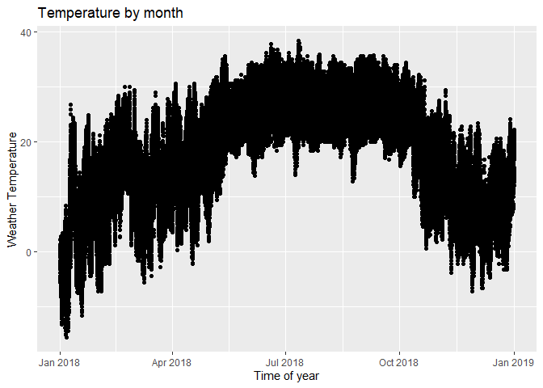
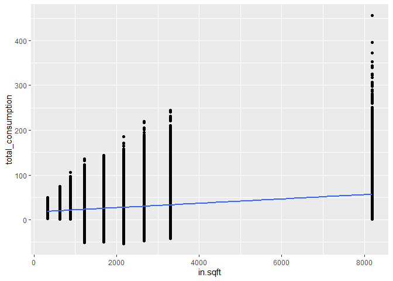

EDA
================
2023-11-27

#### Table of Contents
- [import data](#import-data)
- [Data preparation: Merge all data by day](#Data-preparation:-Merge-all-data-by-day)
  * [Aggregate weather data by county and by day](#aggregate-weather-data-by-county-and-by-day)
- [which month is the coldest and hottest?](#which-month-is-the-coldest-and-hottest?)
- [Does any variable is dependent on the temperature?](#does-any-variable-is-dependent-on-the-temperature?)
- [Does any variable is dependent on the house size?](#does-any-variable-is-dependent-on-the-house-size?)

<small><i><a href='http://ecotrust-canada.github.io/markdown-toc/'>Table of contents generated with markdown-toc</a></i></small>


``` r
library (tinytex)
```

# import data

``` r
library (arrow)
```

    ## 
    ## Attaching package: 'arrow'

    ## The following object is masked from 'package:utils':
    ## 
    ##     timestamp

``` r
library (tidyverse)
```

    ## ── Attaching core tidyverse packages ──────────────────────── tidyverse 2.0.0 ──
    ## ✔ dplyr     1.1.4     ✔ readr     2.1.4
    ## ✔ forcats   1.0.0     ✔ stringr   1.5.1
    ## ✔ ggplot2   3.4.4     ✔ tibble    3.2.1
    ## ✔ lubridate 1.9.3     ✔ tidyr     1.3.0
    ## ✔ purrr     1.0.2

    ## ── Conflicts ────────────────────────────────────────── tidyverse_conflicts() ──
    ## ✖ lubridate::duration() masks arrow::duration()
    ## ✖ dplyr::filter()       masks stats::filter()
    ## ✖ dplyr::lag()          masks stats::lag()
    ## ℹ Use the conflicted package (<http://conflicted.r-lib.org/>) to force all conflicts to become errors

``` r
parquet_file <- "C:/Users/fsdel/Documents/2. Learning & Knowledge/1. Data Analytics/Data Science - Masters/Courses/Fall 23/IDS/Final Project/Cleaned Files/Energy Data divided by day by category.parquet"
df_house <- read_parquet(parquet_file)


file_path <- "C:/Users/fsdel/Documents/2. Learning & Knowledge/1. Data Analytics/Data Science - Masters/Courses/Fall 23/IDS/Final Project/Cleaned Files/Weather Data Cleaned.csv"
df_weather <- read_csv(file_path)
```

    ## Rows: 402960 Columns: 7
    ## ── Column specification ────────────────────────────────────────────────────────
    ## Delimiter: ","
    ## chr  (1): county
    ## dbl  (5): Dry.Bulb.Temperature...C., Hour, day, month, year
    ## dttm (1): date_time
    ## 
    ## ℹ Use `spec()` to retrieve the full column specification for this data.
    ## ℹ Specify the column types or set `show_col_types = FALSE` to quiet this message.

``` r
file_path <- "C:/Users/fsdel/Documents/2. Learning & Knowledge/1. Data Analytics/Data Science - Masters/Courses/Fall 23/IDS/Final Project/Cleaned Files/Static House Data Cleaned.csv"
df_static <- read_csv (file_path)
```

    ## Rows: 5710 Columns: 77
    ## ── Column specification ────────────────────────────────────────────────────────
    ## Delimiter: ","
    ## chr (66): in.building_america_climate_zone, in.ceiling_fan, in.clothes_dryer...
    ## dbl (11): bldg_id, in.sqft, in.bathroom_spot_vent_hour, in.bedrooms, in.cool...
    ## 
    ## ℹ Use `spec()` to retrieve the full column specification for this data.
    ## ℹ Specify the column types or set `show_col_types = FALSE` to quiet this message.

``` r
parquet_file <- "C:/Users/fsdel/Documents/2. Learning & Knowledge/1. Data Analytics/Data Science - Masters/Courses/Fall 23/IDS/Final Project/Cleaned Files/Energy Data divided by month by category.parquet"
df_house_by_month<-read_parquet(parquet_file)
```

# Data preparation: Merge all data by day

## Aggregate weather data by county and by day

``` r
df_weather_mean_by_day<- df_weather %>%
  group_by(county, date_time = lubridate::floor_date(date_time, "day")) %>%
  summarise (mean_temp = mean (Dry.Bulb.Temperature...C.))
```

    ## `summarise()` has grouped output by 'county'. You can override using the
    ## `.groups` argument.

# which month is the coldest and hottest?

``` r
# ----
# Which month is the hottest
  # Create a line chart to view which is the hottest month but is not clear if june
  # or july
ggplot(df_weather)+ 
  aes(x=date_time, y=Dry.Bulb.Temperature...C.) +
  xlab("Time of year")+
  ylab ("Weather Temperature")+
  geom_point()+
  ggtitle("Temperature by month")
```

<!-- -->

``` r
  # doing an agreggation to determine which is the hottest month. We can see that
  # july is the month with the highest min temperature and max temperature compared 
  # to june. The coldest month is January.
df_weather %>%
  group_by(month) %>% 
  summarise(mean = mean (Dry.Bulb.Temperature...C.),
            min = min (Dry.Bulb.Temperature...C.),
            max = max (Dry.Bulb.Temperature...C.),
            median = median (Dry.Bulb.Temperature...C.))
```

    ## # A tibble: 12 × 5
    ##    month  mean    min   max median
    ##    <dbl> <dbl>  <dbl> <dbl>  <dbl>
    ##  1     1  5.10 -15.6   26.7   4.4 
    ##  2     2 14.1   -7.2   30    15   
    ##  3     3 11.5   -5.6   29.4  11.1 
    ##  4     4 16.2   -2.2   30.6  16.7 
    ##  5     5 23.2    4.53  35.6  23.3 
    ##  6     6 26.5   13.7   37.8  26.1 
    ##  7     7 26.4   13.9   38.3  25.8 
    ##  8     8 26.3   12.8   35.6  25.8 
    ##  9     9 25.9   16.7   35.8  25.3 
    ## 10    10 19.2    0.56  34.4  20   
    ## 11    11 11.1   -7.22  29.4  10.6 
    ## 12    12  9.33  -6.67  24.1   9.15

# Does any variable is dependent on the temperature?

Explore correlations with temperature: Some variables are correlated
with the temperature like AC or heating but others are not

``` r
parquet_file <- "C:/Users/fsdel/Documents/2. Learning & Knowledge/1. Data Analytics/Data Science - Masters/Courses/Fall 23/IDS/Final Project/EDA/All data merged by day.parquet"

df_merge<-read_parquet(parquet_file)

# code to create a graph and see the correlation between two variables
df_merge %>% ggplot () + aes (x= in.sqft, y=total_consumption) +geom_point() + geom_smooth(method="lm", se=TRUE)
```

    ## `geom_smooth()` using formula = 'y ~ x'

<!-- -->

``` r
# Identify numeric columns
num_cols <- sapply(df_merge, is.numeric)

sum (num_cols)
```

    ## [1] 33

``` r
# DO the correlation matrix for temperature

cor_matrix_temp <- cor (df_merge[, num_cols],df_merge$mean_temp)
cor_matrix_temp
```

    ##                                               [,1]
    ## building_id                           0.0014751150
    ## out.AC                                0.7353483067
    ## out.ceiling_fan                      -0.0700909171
    ## out.dishwasher                       -0.0196046291
    ## out.dryer                            -0.0260389172
    ## out.fireplace                        -0.0126402714
    ## out.freezer                           0.0632151854
    ## out.grill                            -0.0116617141
    ## out.heating                          -0.6235426240
    ## out.hot_tub                           0.0228091867
    ## out.light                            -0.1005146374
    ## out.plug                             -0.0773760125
    ## out.pool                             -0.0206305086
    ## out.pv                               -0.0085811166
    ## out.range                            -0.0284814713
    ## out.refrigerator                      0.1379902860
    ## out.ventilation                       0.0062264650
    ## out.washer                            0.0090258207
    ## out.hot_water                        -0.2324445500
    ## out.well                             -0.0268575064
    ## total_consumption                    -0.0572861074
    ## total_consumption_without_PV         -0.0565316197
    ## in.sqft                               0.0078609933
    ## in.bathroom_spot_vent_hour           -0.0005893321
    ## in.bedrooms                           0.0052383937
    ## in.cooling_setpoint                  -0.0019262101
    ## in.cooling_setpoint_offset_magnitude  0.0008660699
    ## in.geometry_stories                   0.0049968263
    ## in.heating_setpoint                  -0.0058994101
    ## in.heating_setpoint_offset_magnitude  0.0035602931
    ## in.occupants                          0.0048801172
    ## in.range_spot_vent_hour              -0.0018536916
    ## mean_temp                             1.0000000000

# Does any variable is dependent on the house size?

Explore correlation with SQFT Some variables are correlated with the
SQFT like plug or light but others are not

``` r
# DO the correlation matrix for sqft
cor_matrix_sqt <- cor (df_merge[, num_cols],df_merge$in.sqft)

cor_matrix_sqt
```

    ##                                               [,1]
    ## building_id                           0.0018430732
    ## out.AC                                0.2340830398
    ## out.ceiling_fan                      -0.0022268485
    ## out.dishwasher                        0.0155400867
    ## out.dryer                             0.0283733189
    ## out.fireplace                         0.0212047639
    ## out.freezer                           0.0099804975
    ## out.grill                             0.0294814440
    ## out.heating                           0.1351471316
    ## out.hot_tub                           0.0759230007
    ## out.light                             0.4700140711
    ## out.plug                              0.2774483646
    ## out.pool                              0.0515555083
    ## out.pv                                0.0074320942
    ## out.range                             0.0267997772
    ## out.refrigerator                     -0.0096469414
    ## out.ventilation                       0.3639259350
    ## out.washer                            0.0321140074
    ## out.hot_water                         0.0940366642
    ## out.well                              0.1298027540
    ## total_consumption                     0.4293168890
    ## total_consumption_without_PV          0.4331211059
    ## in.sqft                               1.0000000000
    ## in.bathroom_spot_vent_hour           -0.0060892944
    ## in.bedrooms                           0.4473598611
    ## in.cooling_setpoint                   0.0114166940
    ## in.cooling_setpoint_offset_magnitude -0.0106200765
    ## in.geometry_stories                   0.3052935298
    ## in.heating_setpoint                   0.0008159893
    ## in.heating_setpoint_offset_magnitude  0.0206383446
    ## in.occupants                          0.1796899550
    ## in.range_spot_vent_hour               0.0061337793
    ## mean_temp                             0.0078609933
